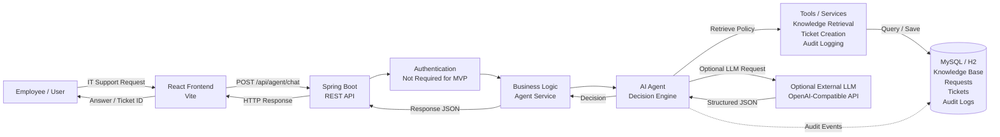
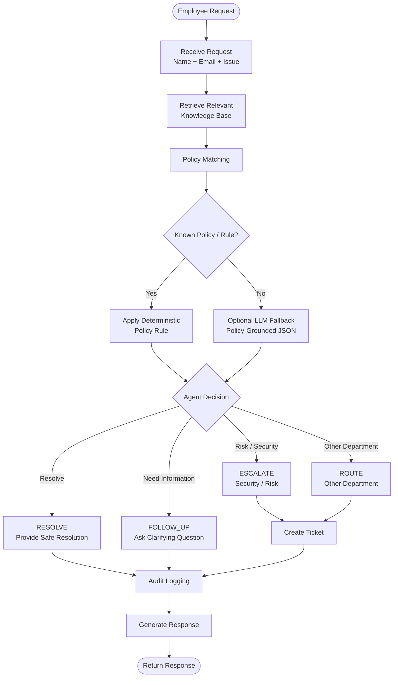
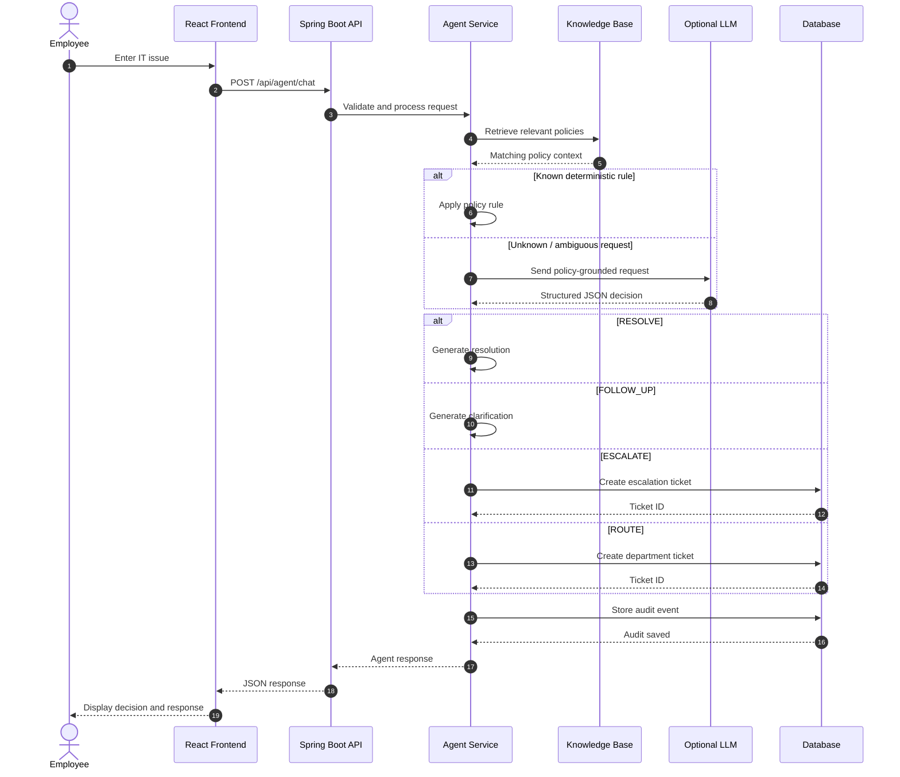

# Veridian IT Support - Internal Service Agent

An internal IT helpdesk agent for Veridian Corp. The application uses deterministic, policy-grounded rules for the assignment scenarios and an optional LLM fallback only when the request cannot be resolved by a known rule.

---

## Workflow

```text
Employee Request
       ↓
Knowledge Retrieval
       ↓
Policy Matching
       ↓
Agent Decision
       ↓
Ticket Creation
       ↓
Audit Logging
       ↓
Response
```

---

## Architecture

### High-Level Architecture



### Architecture Components

| Layer | Responsibility |
|---|---|
| React Frontend | Employee support interface |
| Spring Boot API | REST endpoints and request handling |
| Business Logic | Validation, orchestration and agent execution |
| Agent | Policy matching and decision making |
| Knowledge Base | Internal IT policies and resolutions |
| Ticket Service | Creates structured support tickets |
| Audit Service | Records important agent actions |
| Database | Stores policies, requests, tickets and audit logs |
| Optional LLM | Handles requests not covered by deterministic rules |

---

## AI Agent Workflow



### Decision Types

- **RESOLVE** — Provide a safe policy-based resolution.
- **FOLLOW_UP** — Ask for missing information.
- **ESCALATE** — Escalate risky or security-sensitive requests.
- **ROUTE_TO_OTHER_DEPARTMENT** — Send requests owned by another department.

---

## Request-Response Flow



---

## Key Features

- Natural-language employee IT support
- Policy-grounded deterministic decision making
- Optional LLM fallback
- Knowledge-base retrieval
- Automatic ticket creation
- Security escalation
- Department routing
- Follow-up questions for ambiguous requests
- Audit logging
- Historical ticket context
- Safe error responses

---

## Assignment Scenarios

The backend seeds:

- **KB-01 through KB-10**
- **Asset Management Policy**
- **REQ-01 through REQ-15**
- Existing **TK-1042 through TK-1051** ticket history

Historical tickets are surfaced as context and do **not** replace a new decision.

---

## Policy Behavior Highlights

### Guest Wi-Fi

Guest Wi-Fi requests are resolved without creating an IT ticket.

### Security Incidents

Suspected phishing, malware, or unauthorized access is escalated to Security.

The agent explicitly warns employees **not to forward suspicious emails to other employees**.

### Contractor VPN

Contractor VPN access is routed for the required manager approval.

### Software Installation

Non-catalog software and browser extensions are routed for Security review.

### Hardware Replacement

Hardware replacement does not receive unsupported automatic approval.

IT verification and Finance & Assets review are required where the applicable refresh policies overlap.

### Expense Software

Expense management access is owned by Finance.

IT handles only technical login issues after an account already exists.

### Ambiguous Requests

Requests such as:

> "It's not working."

result in a follow-up request for missing information such as:

- Service or application
- Device
- Error message
- Expected behavior

---

## Technology Stack

| Category | Technology |
|---|---|
| Frontend | React, Vite |
| Backend | Java 21, Spring Boot |
| API | REST / JSON |
| Database | MySQL 8+ / H2 Development DB |
| ORM | Spring Data JPA |
| AI | Optional OpenAI-compatible LLM |
| Build | Maven |
| Package Manager | npm |
| Version Control | Git / GitHub |

---

## Requirements

- Java 21
- Maven
- Node.js 18+
- MySQL 8+

---

## Configuration

Set the variables from `backend/.env.example` in your shell, IDE launch configuration, or local environment file.

> Spring Boot does not load `.env` files automatically.

No secrets are committed to the repository.

### Required Database Variables

```env
DB_URL=jdbc:mysql://localhost:3306/veridian_agent?createDatabaseIfNotExist=true&serverTimezone=UTC
DB_USERNAME=root
DB_PASSWORD=your-local-password
CORS_ALLOWED_ORIGINS=http://localhost:5173,http://127.0.0.1:5173
```

### Optional LLM Variables

```env
OPENAI_API_KEY=
OPENAI_MODEL=gpt-4o-mini
OPENAI_BASE_URL=https://api.openai.com/v1
```

The app works without an LLM key. LLM requests are policy-grounded, JSON-constrained, and time-limited; failures fall back to a safe follow-up response.

---

## Database

Create the database if it does not already exist:

```sql
CREATE DATABASE veridian_agent;
```

For local MySQL:

```sql
USE veridian_agent;
SHOW TABLES;
```

---

## Run Backend

```bash
cd backend
mvn spring-boot:run
```

The default development profile can use the local H2 database under `backend/data/`, which is ignored by Git.

For the explicit H2 development profile:

```bash
mvn spring-boot:run "-Dspring-boot.run.profiles=dev"
```

For MySQL, configure `DB_URL`, `DB_USERNAME`, and `DB_PASSWORD` before running the same command.

---

## Run Frontend

```bash
cd frontend
npm install
npm run dev
```

Open:

```text
http://localhost:5173
```

---

## Docker Deployment

The production image builds the React client and serves it from the Spring Boot
application, so the UI and API are available from one address.

1. Create a root `.env` file with the MySQL credentials (this file is not
   committed):

   ```env
   DB_USERNAME=root
   DB_PASSWORD=replace-with-your-password
   # Optional: enable the LLM fallback
   # OPENAI_API_KEY=...
   ```

2. Build and start the application:

   ```bash
   docker compose up --build -d
   ```

3. Open `http://localhost:8080`. Stop the application with `docker compose down`.

To build only the deployable application image:

```bash
docker build -t veridian-it-agent:latest .
```

When running that image outside Compose, provide `DB_URL`, `DB_USERNAME`, and
`DB_PASSWORD` for an accessible MySQL instance. The container listens on port
`8080`.

---

## API Endpoints

| Method | Endpoint | Purpose |
|---|---|---|
| POST | `/api/agent/chat` | Submit an employee support request |
| GET | `/api/requests` | Retrieve support requests |
| GET | `/api/tickets` | Retrieve tickets |
| GET | `/api/tickets/{id}` | Retrieve a specific ticket |
| GET | `/api/audit/{requestId}` | Retrieve audit events |

---

## Example Request

```http
POST /api/agent/chat
Content-Type: application/json
```

```json
{
  "employeeName": "Ananya Reddy",
  "employeeEmail": "ananya.reddy@veridian-corp.example",
  "message": "I think I received a phishing email asking for my login."
}
```

---

## Error Handling

Invalid request payloads return **HTTP 400** with a safe validation message.

Unexpected backend failures return **HTTP 500** without exposing stack traces or implementation details.

---

## Testing

```bash
cd backend
mvn clean test
```

The assignment test suite covers all 15 employee requests plus guest Wi-Fi no-ticket behavior, phishing safety, ambiguous requests, historical ticket context, policy-based routing, and escalation behavior.

Build the frontend:

```bash
cd frontend
npm run build
```

---

## Project Structure

```text
veridian-it-agent/
├── backend/
│   ├── src/main/java/com/veridian/agent/
│   │   ├── config/
│   │   ├── controller/
│   │   ├── dto/
│   │   ├── entity/
│   │   ├── repository/
│   │   └── service/
│   ├── src/main/resources/application.properties
│   ├── pom.xml
│   └── .env.example
├── frontend/
│   ├── src/
│   │   ├── main.jsx
│   │   └── styles.css
│   ├── package.json
│   └── index.html
├── docs/
│   ├── architecture.md
│   └── demo-script.md
├── README.md
└── .gitignore
```

---

## Security & Safety Design

The agent follows a policy-first approach:

```text
Employee Request
       ↓
Known Policy?
   ↙         ↘
 YES         NO
  ↓           ↓
Deterministic  Optional LLM
Rule           Fallback
  ↓           ↓
      Safe Decision
            ↓
       Audit Logging
```

Important safety behaviors:

- Security-sensitive requests are escalated.
- Suspicious phishing emails should not be forwarded.
- Unknown or ambiguous requests do not receive unsafe automatic resolutions.
- LLM output is constrained to structured JSON.
- LLM failures fall back to a safe response.
- API errors do not expose internal stack traces.
- Secrets are excluded from source control.

---

## Demo Scenarios

### Password Lockout

```text
"I'm locked out of my account after entering my password 6 times."
```

**Expected:** `RESOLVE`

### VPN Credential Expired

```text
"My VPN says my credentials have expired."
```

**Expected:** `RESOLVE`

### Phishing Email

```text
"I received a phishing email asking for my login."
```

**Expected:** `ESCALATE → Security`

### Expense Access

```text
"I need access to the expense management system."
```

**Expected:** `ROUTE → Finance`

### Ambiguous Request

```text
"It's not working."
```

**Expected:** `FOLLOW_UP`

The agent asks for additional information before taking action.

---

## GitHub

Repository:

https://github.com/Utkarshgupta2027/veridian-it-support-agent

---

## Demo

Run the backend and frontend locally, then open:

```text
http://localhost:5173
```

Recommended demo flow:

```text
Employee Request
      ↓
Policy Retrieval
      ↓
Agent Decision
      ↓
Ticket / Resolution
      ↓
Audit Log
      ↓
Final Response
```

---

## Project Goal

The goal of this MVP is to demonstrate how an internal AI service agent can combine:

- Natural-language understanding
- Internal knowledge retrieval
- Deterministic business rules
- Optional LLM reasoning
- Safe escalation
- Ticket creation
- Auditability

into a single employee IT support workflow.
